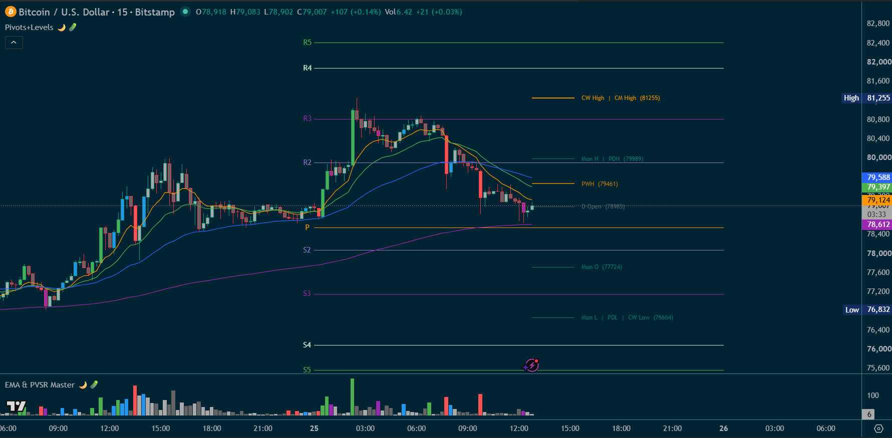

# TradingView Pine Script Indicators & Strategies (v6)

[](https://www.tradingview.com/pine-script-docs/)
[](https://opensource.org/licenses/MPL-2.0)
[](https://www.tradingview.com/)



A curated collection of modular, production-ready Pine Script v6 indicators and strategies for TradingView. Designed for active traders, swing traders, and technical analysts seeking clean charts, synchronized volume-spread classification, automated multi-timeframe key levels, and regime-hedged scalping strategies without cluttering the screen.

---

## 📑 Table of Contents

- [Featured Indicators & Strategies](#-featured-indicators--strategies)
  - [1. EMA & PVSR Master](#1-ema--pvsr-master)
  - [2. Pivots + Key Levels Master](#2-pivots--key-levels-master)
  - [3. BTC 5M & 15M Scalping Strategy Pair](#3-btc-5m--15m-scalping-strategy-pair)
- [Installation Guide](#-installation-guide)
- [TradingView Limits & Best Practices](#-tradingview-limits--best-practices)
- [Repository Structure](#-repository-structure)
- [License & Disclaimer](#-license--disclaimer)

---

## 🚀 Featured Indicators & Strategies

### 1. [EMA & PVSR Master](ema_pvsr_master.pine)
> **Combines multi-period moving averages, VWAP, and synchronized PVSRA volume classification into a single unified script.**

- **Synchronized Volume Analysis**: Computes PVSRA (Price Volume Spread Analysis) once to synchronously drive both the price-chart candle coloring and the lower volume pane bars, eliminating color drift.
- **Volume Classification Modes**:
  - **Climax (Green/Red)**: Multiplier-based volume surge or lookback volume × spread high.
  - **Above-Average (Blue/Violet)**: Moderate volume expansion.
  - **Regular (Gray)**: Normal trading activity.
- **Dynamic Vector Zones**: Automatically generates order-flow supply (bearish vector) and demand (bullish vector) boxes with customizable mitigation rules (close vs. wick) and maximum zone retention.
- **Moving Average Suite**: 6 configurable EMAs (10, 21, 50, 100, 200, 800), 3 SMAs (50, 100, 200), anchored VWAP, and independent Golden / Death Cross detection.
- **Integrated Alerts**: Cross alerts (EMA/SMA, VWAP) and vector candle signals.

📖 **Detailed Documentation**: [ema_pvsr_master.description.md](ema_pvsr_master.description.md)

---

### 2. [Pivots + Key Levels Master](pivots_and_key_levels_master_.pine)
> **Multi-timeframe Fibonacci and Camarilla pivot points combined with higher-timeframe (HTF) key structural levels and smart label merging.**

- **Advanced Pivot System**:
  - Selectable calculations: **Fibonacci** or **Camarilla** (with R1–R5 / S1–S5 mapping).
  - Multi-timeframe support: Auto, Hourly, Daily, Weekly, Monthly, Quarterly, Yearly, Biyearly, Triyearly, Quinquennial.
  - Historical lookback control to respect TradingView drawing budgets.
- **Multi-Timeframe Key Levels**:
  - **Monday Range**: Live developing Monday Open, High, Low, and Midpoint.
  - **Daily**: Previous Day High/Low/Midpoint (PDH/PDL/pMid), Today's Open.
  - **Weekly**: Current Week High/Low/Midpoint (live), Previous Week High/Low/Midpoint (PWH/PWL).
  - **Monthly & Yearly**: Live developing and previous period extremes, midpoints, and opens.
- **Smart Level Merging**: Levels within a configurable tick tolerance dynamically collapse into a single line with concatenated labels (e.g., `PDH | CW High`) to prevent overlapping line clutter.
- **Budget-Optimized**: Actively manages TradingView's 500-line / 500-label object limits for maximum responsiveness.

📖 **Detailed Documentation**: [pivots_and_key_levels_master.description.md](pivots_and_key_levels_master.description.md)

---

### 3. [BTC 5M & 15M Scalping Strategy Pair](BTC%205M%20&%2015M%20Strategies/STRATEGY_GUIDE.md)
> **A regime-hedged pair of Pine Script v6 strategies engineered for 5m and 15m Bitcoin trading, complete with built-in R-multiple performance analytics tables.**

- **[Camarilla Range Bounce Scalper](BTC%205M%20&%2015M%20Strategies/camarilla_range_bounce_1.pine)**:
  - **Mean-Reversion Thesis**: Fades touches of Camarilla S3 (long) and R3 (short) during low-volatility/ranging market conditions, targeting the central pivot (PP) and opposite boundaries with stops beyond S4/R4.
  - **Regime Filters**: ADX max threshold (< 22), price containment within S3/R3 over lookback window, optional BB width percentile filter, and RSI extreme confirmation.
  - **Scale-Out Mechanics**: Takes 50% TP1 at central pivot (PP), moves stop to breakeven, and lets TP2 run to opposite R3/S3 level.

- **[EMA 9/21 Pullback Continuation](BTC%205M%20&%2015M%20Strategies/ema_pullback_continuation.pine)**:
  - **Trend-Following Thesis**: Captures pullback continuation in strong trends using a 3-state machine (**ARM** on EMA touch, **FIRE** on resumption close, **DISARM** on 21 EMA breach or bar expiry) with clear on-chart state shading.
  - **Regime Filters**: High ADX requirement (> 22), 9/21 EMA separation spacing, and higher-timeframe EMA direction alignment (1H for 5m chart / 4H for 15m chart).
  - **Runner Exits**: Features customizable Chandelier trailing stops, slow EMA trails, or fixed R-multiple targets to preserve multi-R trend outliers.

- **Honest R-Multiple Analytics**: Both strategies feature dynamic on-chart performance tables tracking net R-multiples, win rates, and trade distributions sliced by ADX regime, UTC trading session (Asia/London/NY), and direction.

📖 **Detailed Strategy & Calibration Guide**: [STRATEGY_GUIDE.md](BTC%205M%20&%2015M%20Strategies/STRATEGY_GUIDE.md)

---

## 🛠 Installation Guide

Follow these steps to add any indicator or strategy from this repository to your TradingView chart:

1. Open **[TradingView](https://www.tradingview.com/)** and navigate to your chart.
2. At the bottom of the screen, open the **Pine Editor** tab.
3. Click **Open** -> **New Indicator** (or **New Strategy** for strategy scripts).
4. Copy the entire raw code from the desired `.pine` file:
   - [ema_pvsr_master.pine](ema_pvsr_master.pine)
   - [pivots_and_key_levels_master_.pine](pivots_and_key_levels_master_.pine)
   - [camarilla_range_bounce_1.pine](BTC%205M%20&%2015M%20Strategies/camarilla_range_bounce_1.pine)
   - [ema_pullback_continuation.pine](BTC%205M%20&%2015M%20Strategies/ema_pullback_continuation.pine)
5. Paste the code into the Pine Editor.
6. Click **Save** and give the script a name.
7. Click **Add to Chart**.

> [!TIP]
> **Volume Pane Placement (EMA & PVSR Master)**:
> The EMA & PVSR script is configured with `overlay=false` so the volume histogram renders in its own pane below the chart while moving averages and candle coloring are forced onto the main price scale via `force_overlay=true`. If the volume pane lands directly on the price chart upon adding, right-click the indicator name in the legend and select **Move to -> New pane below**.

---

## ⚡ TradingView Limits & Best Practices

- **Object Budget (500 Lines / 500 Labels)**:
  TradingView places a strict maximum of 500 lines, 500 labels, and 500 boxes per indicator. Both scripts are engineered to stay well within these limits during normal usage. If you enable all historical pivot levels with large lookbacks, older drawings will automatically roll off.
- **Bar Replay Behavior**:
  Higher timeframe key levels (Weekly, Monthly, Yearly) render on the latest bar for real-time performance. In bar replay mode, developing levels reflect the latest historical bar reached by the replay simulator.
- **Execution Engine**:
  All scripts are written in **Pine Script v6**, taking advantage of the latest language optimizations and type safety features.

---

## 📂 Repository Structure

```text
├── README.md                                  # Repository overview and quick start guide
├── LICENSE                                    # Mozilla Public License 2.0
├── .gitignore                                 # Standard Git ignore configuration
├── lead-image.png                             # Main repository header preview image
├── ema_pvsr_master.pine                       # EMA & PVSR Master indicator source code
├── ema_pvsr_master.description.md             # Complete documentation for EMA & PVSR Master
├── pivots_and_key_levels_master_.pine         # Pivots + Key Levels Master source code
├── pivots_and_key_levels_master.description.md # Complete documentation for Pivots + Key Levels
└── BTC 5M & 15M Strategies/                   # BTC 5m & 15m scalping strategies directory
    ├── STRATEGY_GUIDE.md                      # Setup, calibration, and backtesting guide
    ├── camarilla_range_bounce_1.pine          # Camarilla Range Bounce mean-reversion strategy
    └── ema_pullback_continuation.pine         # EMA 9/21 Pullback Continuation trend strategy
```

---

## 📜 License & Disclaimer

### License
This project is licensed under the [Mozilla Public License 2.0 (MPL-2.0)](LICENSE). You are free to use, modify, and distribute this software in accordance with the terms of the MPL-2.0 license.

### Disclaimer
*These scripts are provided for educational and informational purposes only. Nothing contained herein constitutes investment, financial, or trading advice. Trading financial markets involves substantial risk of loss. Always conduct your own research and risk management before executing trades.*

